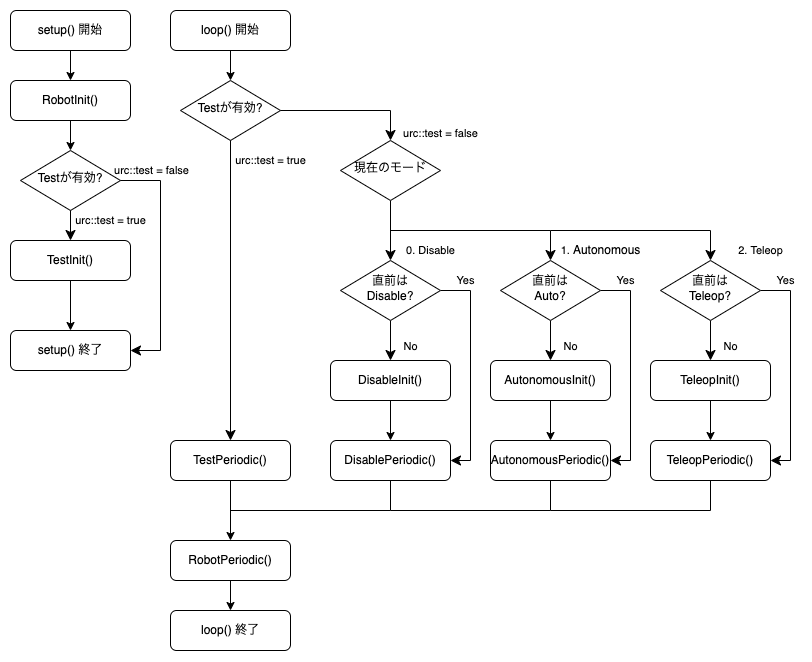

# URC IO-Expander

# プログラム

RobotSystem クラスを継承した Robot クラスを編集することで，それぞれのモードのロボットの動きをプログラムすることができる．(FIRST Robotics の制御系統を参考にしています)

## Disable ~

ロボットが試合前後に行う動き．

## Autonomous ~

ロボットが自動操縦時間中に行う動き．

## Teleop ~

ロボットが手動操縦時間中に行う動き．

## Test ~

bool urc::test をtrueにした時の動き．上の関数は実行されない．

## ~ Init()

各モードの最初に行う動き．

## ~ Periodic()

各モードの最中，Init()後に行い続ける動き．

# 入出力

## dio デジタル入出力

### dio->pinMode(int pin, int status)

pinで指定したデジタルピンの入出力を，INPUT(入力)またはOUTPUT(出力)に設定する．

### dio->Init()

pinModeで指定したデジタルピンの入出力情報を確定させる．

### dio->digitalWrite(int pin, int status)

OUTPUTに設定されたデジタルピンのうち指定したpinの出力を，HIGH(出力オン)またはLOW(出力オフ)に設定する．

### dio->digitalRead(int pin)

pinで指定したデジタルピンの入力状態を取得する．

## pwm PWM出力

### pwm->analogWrite(int pin, int duty)

pinで指定したPWMピンから，duty/4095 のduty比でPWM波を出力する．dutyの最大値は4095．

## ain アナログ入力

### ain->analogRead(int pin)

pinで指定したアナログピンの入力状態を指定する．0Vから2.4Vまでしか測定できない．

## motor モータ出力

### motor[port]->move(int speed)

portで指定したモータ出力ポートに繋がっているモータを動かす．speedは-4096から4095 まで指定でき，正の値を指定すると正転，負の値を指定すると逆転する．0を指定するとフリー回転になる．

### motor[port]->stop()

portで指定したモータ出力ポートに繋がっているモータを止める．角度を止めるように停止する．

## drive 駆動用モータ出力

2つのモータ出力ポートをまとめて動かすためのクラス

### drive->move(int speedL, int speedR)

左側のモータをduty比speedL/4096で，右側のモータをduty比speedR/4096で動かす．

### drive->stop()

左右のモータを止める．motor.stop()と同様の様子で停止する．
